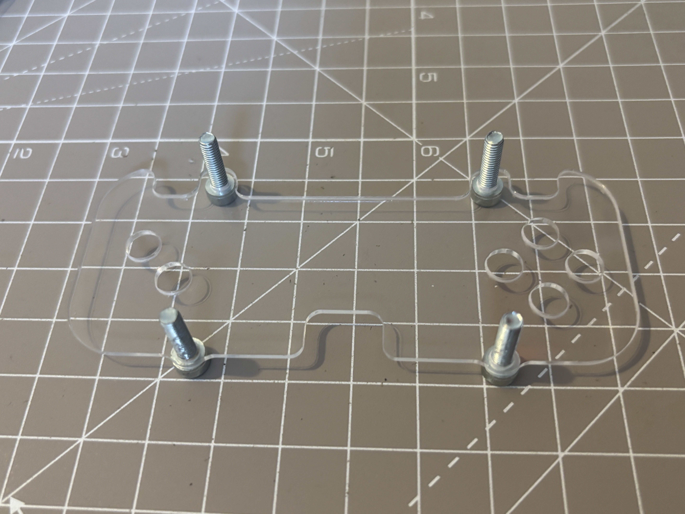
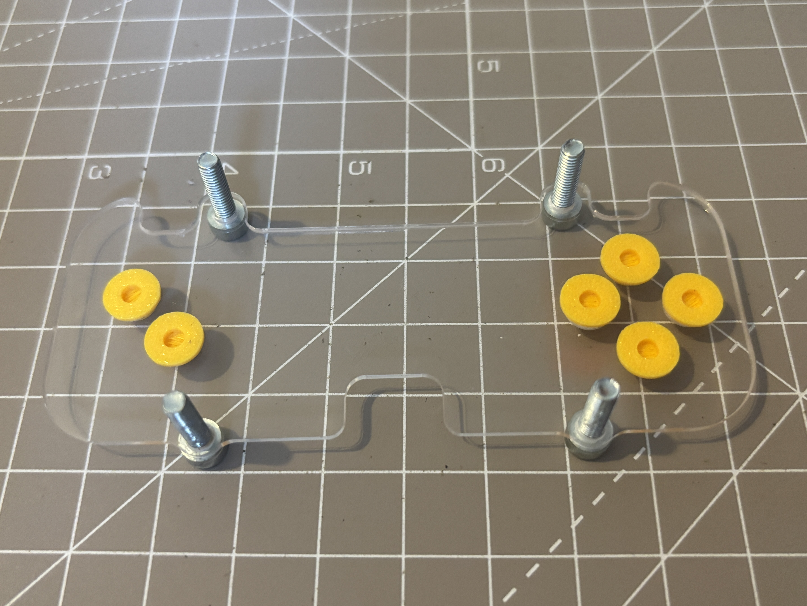
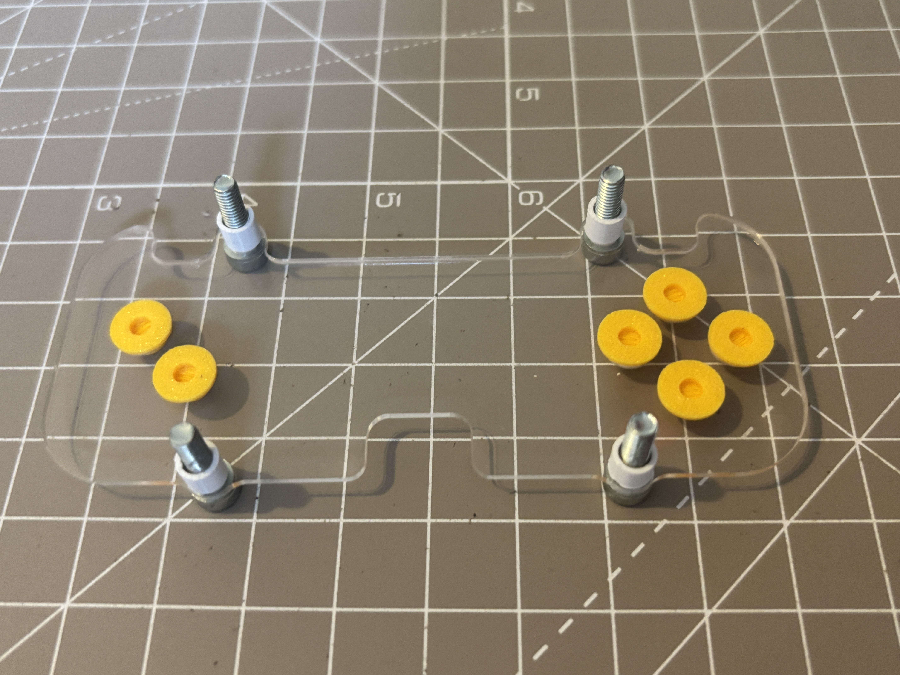
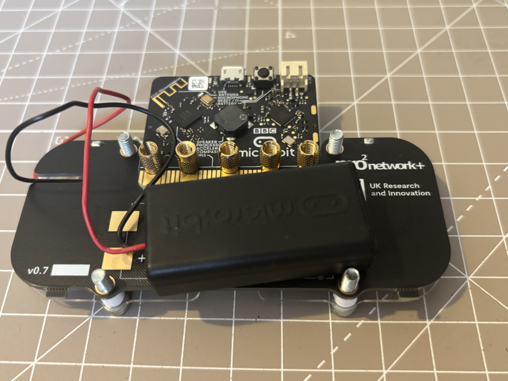
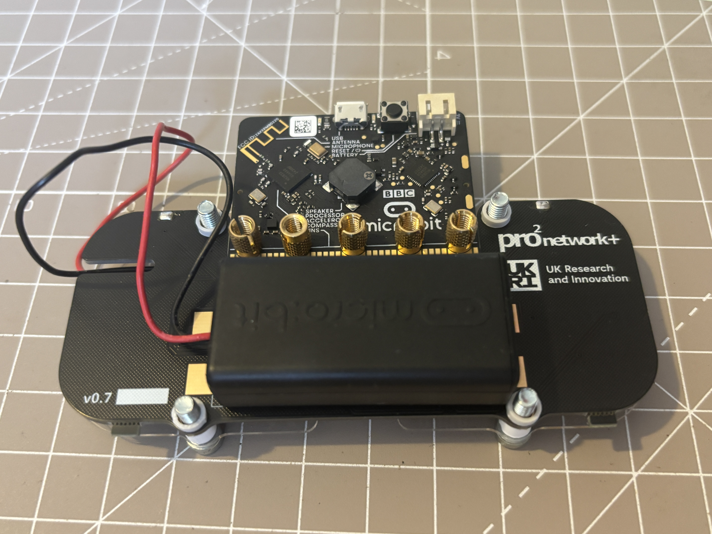
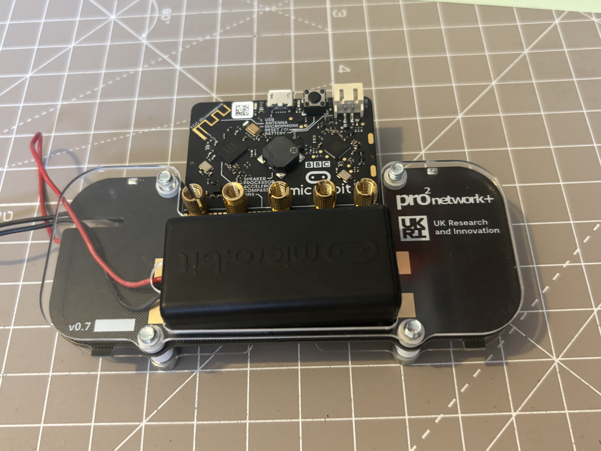
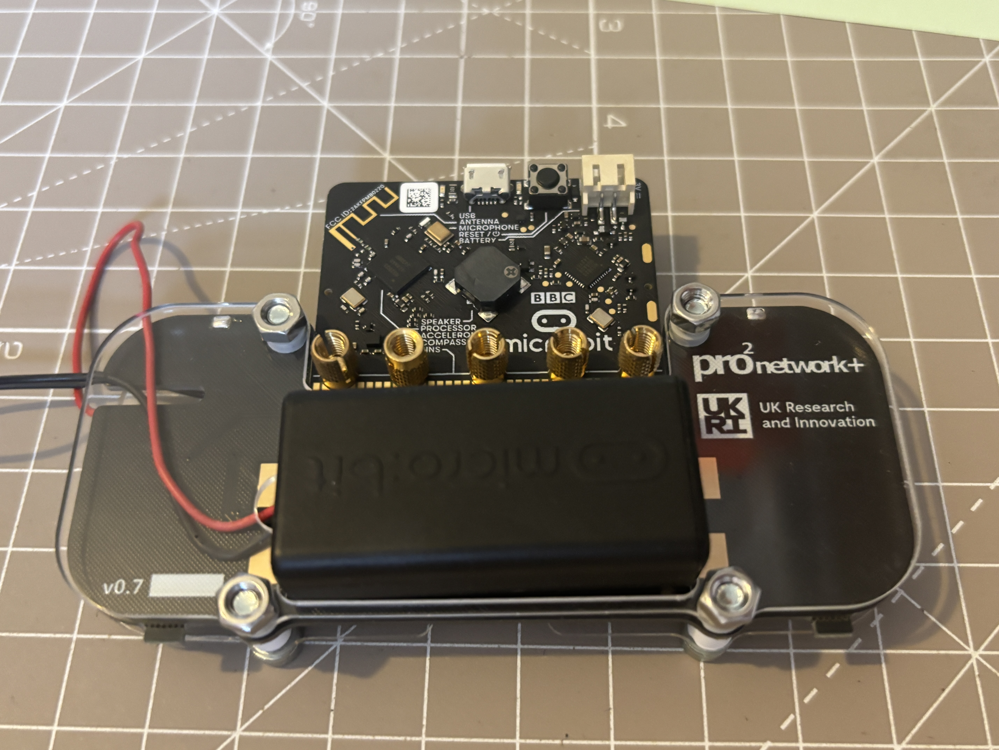

# solder:bit Case Assembly

# Step 1: Front panel
Place the front acrylic panel face down such that the small notch is to the bottom and the D-pad is on the right side. Place the screws pointing up through the holes.

## Step 2: Add the button caps
Place a button cap in each of the holes face down.

## Step 3: Add longer spaces
On each of the four screws place one of the longer (6mm) spacers on top of the acrylic

## Step 4: Add the PCB
Place the PCB face down with battery holder

## Step 5: Add shorter spacers
After the PCB is placed, add one of the shorter spacers on each screw protruding through the stack.

## Step 6: Place the back panel
Make sure that it is oriented the right way so that the notch for the battery wires is on the left hand side where the wires come out.

## Step 7: Add the nuts
Place the nuts on the protruding screws and hand tighten.

