# Electronics enclosure design walk-through with Onshape

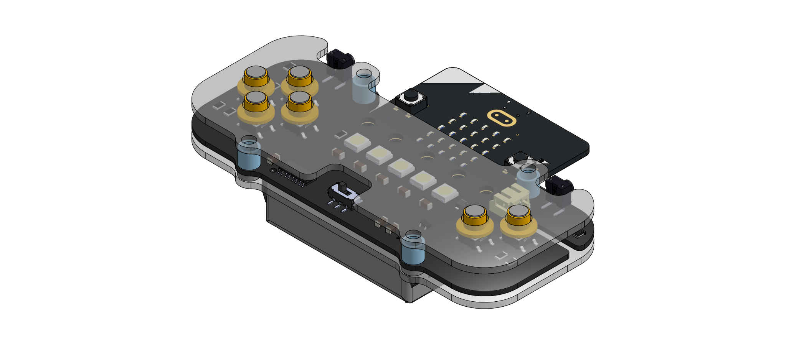

## Workshop activity

In this workshop we’ll be demonstrating how to use computer-aided design (CAD) tools to design enclosures for electronics.

### 1. Create a free Onshape account
Go to [onshape.com](https://www.onshape.com/en/) to create an account. This can be a student account that gives you unlimited private designs, or an account for makers where all your designs are public.

> [!NOTE]  
> We'll be using metric for this workshop, so when creating an account, if you are prompted, we recommend selecting mm with all units.

> [!TIP]  
> It can be much easier to use a mouse rather than a trackpad for working in CAD, even if you brought your own laptop. Consider using the lab computers for a better experience.

### 2.	Create a personal copy of the workspace 
Navigate to this [workspace](https://cad.onshape.com/documents/03e360eab7c280aec5a0fc8e/w/88428d9209ae85e1daa35f17/e/1467ba0b7f908cfe4e9b5ae8?renderMode=0&uiState=687371614301f30186208088) and make a copy to your own account from the hamburger menu in the top right. Take a look at all the design files in the bottom tabs containing part studios and assemblies. The Case Assembly tab is where we will mostly be working from. We’ve inserted a 3D model of the PCB from KiCad into this assembly and started designing parts around it.

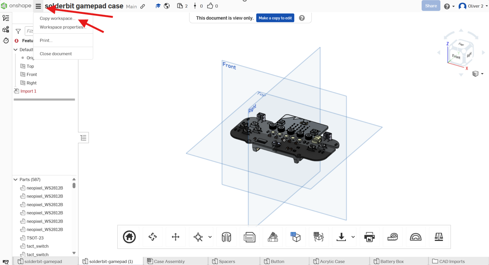

EXTRA TIP: Importing from KiCad

We've done this bit for you and have imported the board to start the design. However, if you're interested in doing this yourself, in KiCad, from the PCB Editor, go to File > Export > STEP / GLB ... , and select STEP as the format. You may need to set the board outline tolerance to "standard (0.01 mm) for it to recognise the boundary.

In Onshape this can then be imported with the plus icon in the bottom file tabs, Importing the step into a new part studio, then inserting the part studio into the assembly as rigid.

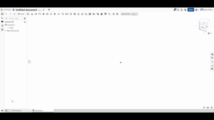

### 3.	Understand the bottom panel design
Enter the Acrylic Case part studio in the bottom tabs. Here, within the context of the main Case Assembly, we’ve designed the bottom panel of the solder:bit case. In the left panel’s feature list, you can see the operations needed to make the back panel: we defined a plane below the bottom surface, we sketched out the outline of the panel,  then we extruded it to make it 3D. You can double click on any of these features to see how they were performed, or even change them. Your job is to replicate these steps for the top panel.

HINT: Can't see the PCB context?

If you don't see the context of the PCB, you may need to select it from the assembly contexts drop down in the top right.

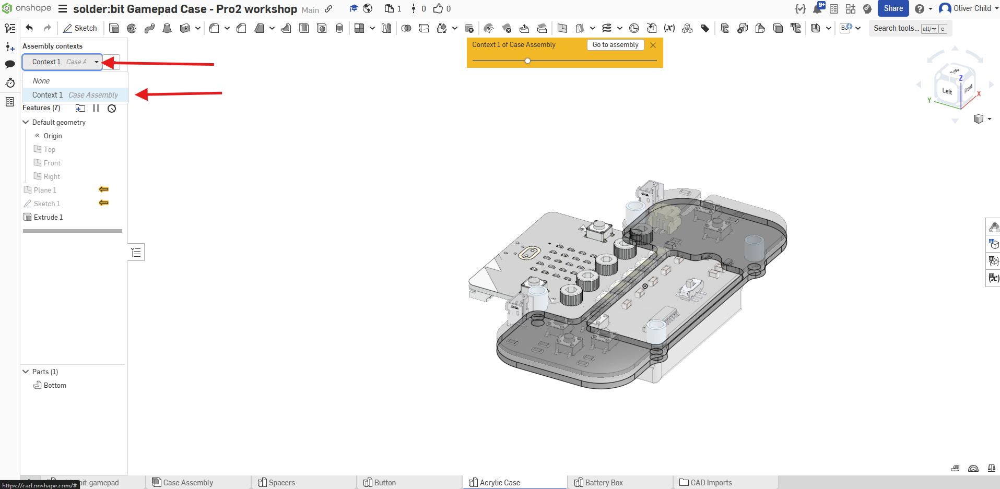

### 4.	Create a new plane
Using the  **Plane** tool, create an offset plane 6mm from the top surface the PCB.

HINT: Creating an offset plane

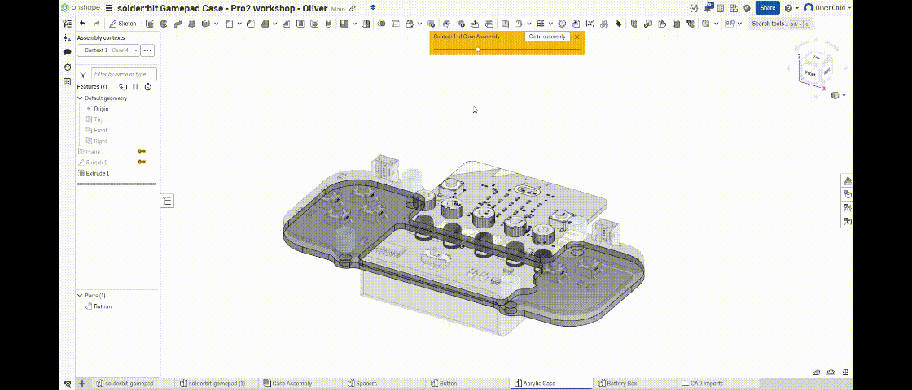

### 5.	Start a sketch
On the plane we just created, start a  **Sketch**. Copy features from the PCB with the  **Use (u)** tool. Specifically, the outline and the 4 x 4mm mounting holes.

> [!TIP]  
> To set the as top-down so that you are face on with the sketch click on the top plane in the view cube in the top right, or press **n** on your keyboard.

HINT: Sketching an using reference geometry

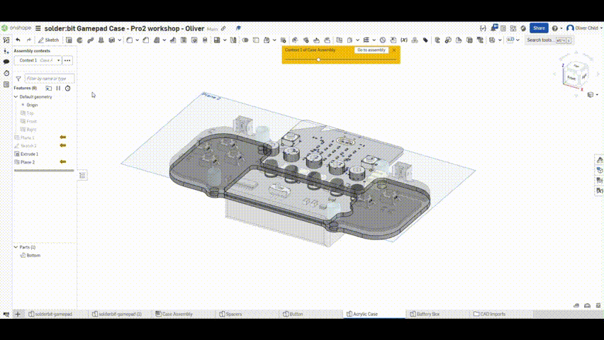

If the context features aren't showing, make sure you've selected the right Assembly context in the top left dropdown.

### 6.	Close the cut-out for the battery
Using the  **Line (l)** and  **Trim (m)** tool, fill in the cut-out made for the battery cable.

HINT: Using trim

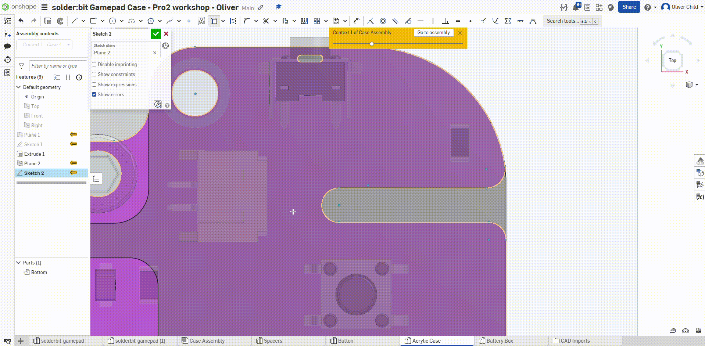

### 7.	Create the cut-outs for the buttons
With the Use tool, project the button positions into the sketch, then Create 7mm circles on each of these positions for the button cut-outs.

> [!TIP]  
> [Construction](https://cad.onshape.com/help/Content/sketch-tools-construction.htm?Highlight=construction) geometry allows you to create geometry elements in your sketches that are not used for creating features. Use the  **Construction (q)** tool with the Use tool in order to project the button geometry into the sketch without having it affect future features. See the next step for what this should look like.

HINT: Using the buttons to draw centred circles

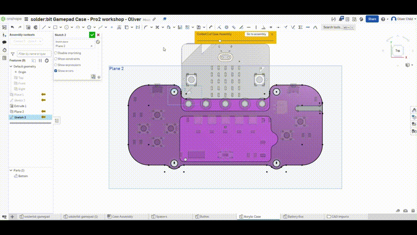

### 8.	Create cut-outs for the L/R buttons and the power switch.
After projecting features of the L and R buttons and power switch into the sketch, draw lines and rectangles to make cut-outs for these. You can use the dimensioning tools and constraints to make sure the cut-outs are correctly positioned.

> [!TIP]  
> [Dimensions](https://cad.onshape.com/help/Content/sketch-tools-dimension.htm) can be specified in your sketches, defining relationships between geometry elements. Use the  **Dimension (d)** tool to add dimensions to your sketch.
>

> [!TIP]  
> [Constraints](https://cad.onshape.com/help/Content/constraints.htm?) are added automatically or manually when you make sketches, defining relationships between geometry elements. 
>
> 

HINT: Creating cut-outs for L,R and power

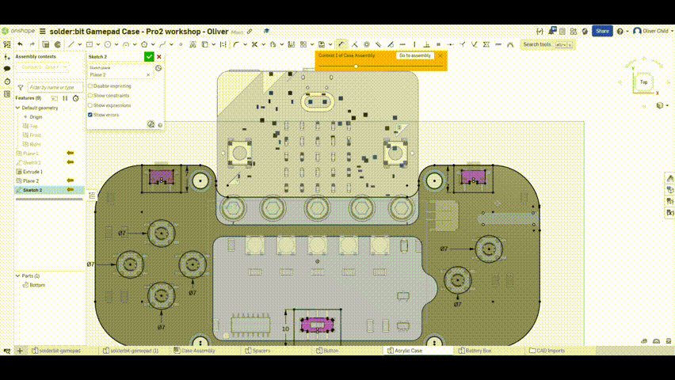

HINT: Over-constrained! Everything went red

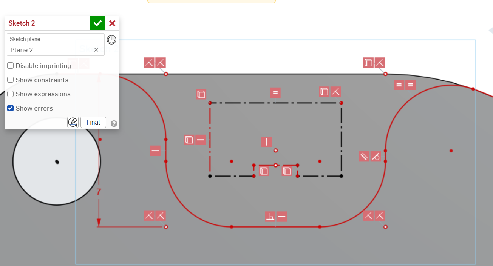
If everything starts going red in your sketch, it's because you've over-constrained the geometry. The constraint solver isn't able to build a valid geometry e.g you've tried to make 3 lines all perpendicular to each other. It's easy to do this because Onshape tries to snap to create automatic constraints. If this happens don't worry, just use ctrl+z until things start looking normal again, and try again. Alternatively, if you can tell what has gone wrong, you can hover over the geometric element that is over-constrained and delete the constraints represented by the little red squares.

### 9.	Clean up the edges and give the cut-outs a 3mm fillet.
With the Trim tool remove any extra edges that create bounded regions that we don't want to extrude. Then use the  **Fillet (shift+f)** tool to round off any corners with a 3mm fillet.

HINT: Using Trim and Fillet

 

Your sketch might look something like this now
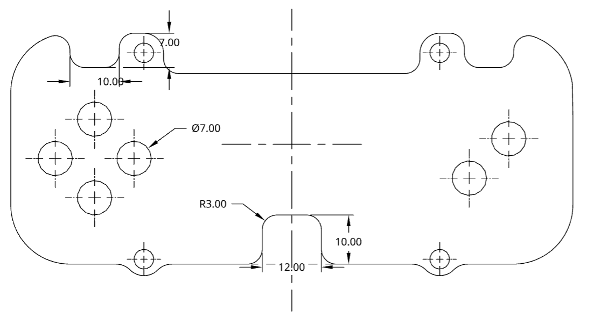

### 10.	Extrude the sketch
Complete the sketch with the green tick, and using the 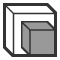 **Extrude (shift+e)** tool, extrude the sketched region by 2mm.

HINT: Using Extrude

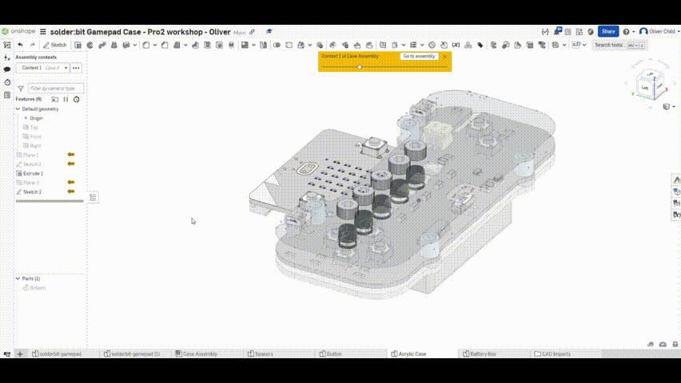

### 11.	Insert the top panel into the assembly
Go back to the assembly and use the  **Insert (i)** tool to place the top panel into the assembly. If you don’t specify a position it will automatically place itself in the position it was in the design context. Click the green tick to confirm. To constrain the part and keep it from moving when you drag it, use the  **Group** tool to group it with the already fixed bottom panel.

HINT: Using insert

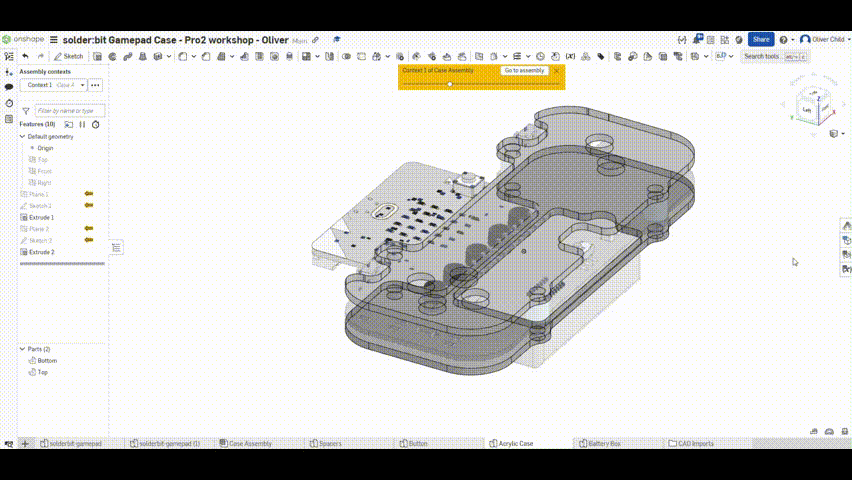

We're done! Laser cutting files can be exported from the Part Studio. Right click on the surface and export the DXF or DWG for the specific face to cut out. You can also export STL, STEP, or 3MF files directly from the parts for 3d printing.

## [Assembly Instructions](Assembly.md)

## Stretch Activities
These activities are designed to push you beyond what we've explored in the previous walkthrough, and to allow you to continue exploring Onshape's features. Feel free to ask us if you need a hand or check out the [Onshape documentation](https://cad.onshape.com/help/Content/introduction.htm) for help.

### **Easy**: Placing button caps
If you have finished designing the top panel, consider placing button caps in the assembly. We've already designed these for you in the Button part studio. Use the Insert tool in the Case Assembly to locate the buttons and place them. Insert the buttons  **as rigid** so that they remain combined when moving them about. Use the  **Fastened Mate** to fix them to the positions in the cut-outs.

###  **Medium**: Place screws and nuts
In the Assembly tab, use the Insert tool to insert parts from "Standard Context". Find an M4 x 16 Socket head screw and an M4 nut to go with it and place it in the assembly.

### **Hard**: Design your own button caps
Have a go at designing your own button caps in context. If you have already inserted the pre-designed button caps, delete one, and from the assembly add a new  **Mate connector** to one of the tops of the buttons. Click on the   **Create new Part Studio in Context** button on the right end of the toolbar. Select the new mate connector as the origin, and a new part studio should open with all the context of the assembly. Try sketching a profile of a button that you can use to make a solid of revolution with. By designing multiple parts, you can create buttons we can 3d print with different colours.

### **Expert**: Make it your own
Use the Onshape workspace as a starting ground to design your own additions to the solder:bit gamepad! E.g. A 3D printed accessory, a novel way to mount it or a way to make it more accessible. 

## Credits

Thanks to John Vidler, Aron Eggens, and Steve Hodges of Lancaster Univeristy [Devices Lab](https://github.com/devices-lab) for help with design and content, everyone at [pro² network+](https://prosquared.org/), and Adam and Tom for the sanity checks.

## License

This project is licensed under the GNU General Public License (GPL), version 3. This license allows you to use, modify, and redistribute the solder:bit Gamepad and any derivative works, but all such derivatives must also be licensed under the GPL.

The GPL ensures that all modifications and improvements to the solder:bit Gamepad remain free and open for the public benefit. By using this project, you agree to abide by its terms and conditions.

For more details on the license, please see the [LICENSE](/LICENSE) file included in this repository.