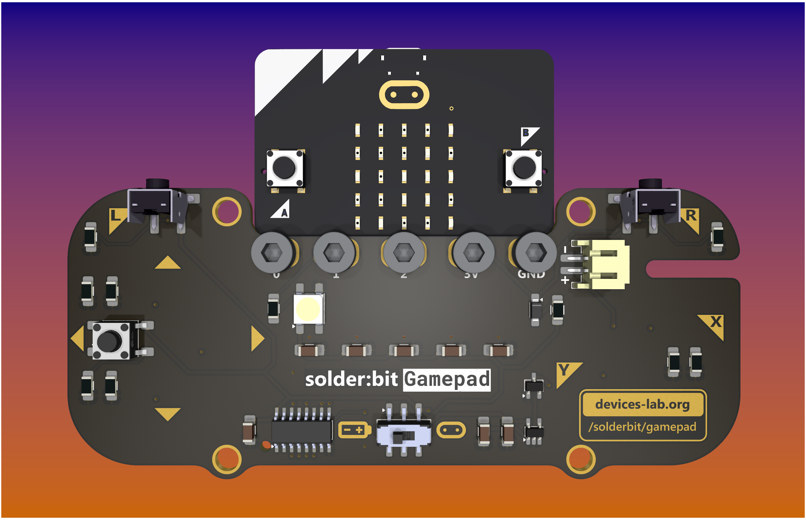

# PCB design walk-through with KiCad

## Workshop activity

You are given the task to complete the solder:bit Gamepad design with the remaining **tactile buttons** and **NeoPixels**.

1. Download or clone this repository.
2. In the [kicad](./kicad/) directory open project file `solderbit-gamepad.kicad_pro`, and begin with the Schematic Editor - follow the instructions in the red boxes to add the missing symbols.
3. Open the PCB Editor and update the changes from the schematic - move the footprints, route the components, fill zones, check DRCs, etc.
4. Generate Gerber files and the bill of materials (BOM) ready for manufacturing!

> Don’t worry if you don’t manage to get all the steps here completed! This activity is intended as a fun learning experience, introducing you to the world of PCB design.

## Useful resources

- [solder:bit Gamepad](https://github.com/devices-lab/solderbit-gamepad) repository
- [KiCad 9.0 ](https://docs.kicad.org/9.0/en/) documentation

## Credits

Thanks to [Dr John Vidler](https://github.com/JohnVidler), Lancaster Univeristy [Devices Lab](https://github.com/devices-lab), and everyone at [pro² network+](https://prosquared.org/).

## License

This project is licensed under the GNU General Public License (GPL), version 3. This license allows you to use, modify, and redistribute the solder:bit Gamepad and any derivative works, but all such derivatives must also be licensed under the GPL.

The GPL ensures that all modifications and improvements to the solder:bit Gamepad remain free and open for the public benefit. By using this project, you agree to abide by its terms and conditions.

For more details on the license, please see the [LICENSE](/LICENSE) file included in this repository.
